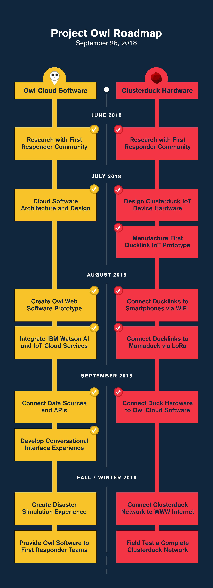

# Submission or project name

  

## Contents

- [Submission or project name](#submission-or-project-name)
  - [Contents](#contents)
  - [Short description](#short-description)
    - [What's the problem?](#whats-the-problem)
    - [How can technology help?](#how-can-technology-help)
    - [The idea](#the-idea)
  - [Demo video](#demo-video)
  - [The architecture](#the-architecture)
  - [Long description](#long-description)
  - [Project roadmap](#project-roadmap)
  - [Getting started](#getting-started)
  - [Live demo](#live-demo)
  - [Built with](#built-with)
  - [Contributing](#contributing)
  - [Versioning](#versioning)
  - [Authors](#authors)
  - [License](#license)
  - [Acknowledgments](#acknowledgments)

## Short description

### What's the problem?

In this modern world, anything is possible through technology. There are lots of developments in all kinds of fields. One of the development is treatment of waste water. Nowadays, water pollution is a major issue, the wastewater which is released by industries without proper treatment affecting water bodies and aquatic lives. As a result, the wastewater must be treated properly by the industries before letting out. The drawback is that it affects the quality of water.

### How can technology help?

The reclamation has become more important with the growing concern over the contamination of water resources due to toxic compounds released by the industries, advanced treatment technologies are required to remove various potentially harmful compounds that could not be effectively removed by conventional treatment processes. So we have used jupyter notebook and Google collaboration. Wastewater treatment involves reduction in pollutants in process from wastewater and proper operation and maintenance of the plant to obtain the desired performance. Wastewater treatment 
technologies are crucial for urban water systems.       

### The idea

Water pollution is the major crisis all over the world. To overcome this we came up with our solution, more efficient way of treating waste water which is let out from the industries. Few industries won’t follow the norms of discharging waste water after the industrial process properly. Our idea is to make the process of water treatment in every industry more appropriate , and make sure that no water containing harmful substances should be let out to the water bodies. Without much of human intervention a machine learning system is designed by bus which can be interfaced by making use of IBM Watson chatbot. Through machine learning it will train the datasets (pertaining to levels of hazardous chemicals present in water after industrial process). Chatbot will get the training from Machine learning algorithm created by us and will act accordingly. It will also alert the person concerned if the water is not treated properly before letting it out. Also our system makes sure that the process is repeated again and water is treated with fully and is safe for letting it out to the water bodies. It will save aquatic life too.

## Demo video

## The architecture

## Long description

[More detail is available here](./docs/DESCRIPTION.md)

## Project roadmap

The project currently does the following things.

- Feature 1
- Feature 2
- Feature 3

It's in a free tier IBM Cloud Kubernetes cluster. In the future we plan to run on Red Hat OpenShift, for example.

See below for our proposed schedule on next steps after Call for Code 2021 submission.

## Getting started

In this section you add the instructions to run your project on your local machine for development and testing purposes. You can also add instructions on how to deploy the project in production.

- [sample-react-app](./sample-react-app/)
- [sample-angular-app](./sample-angular-app/)
- [Explore other projects](https://github.com/upkarlidder/ibmhacks)

## Live demo

You can find a running system to test at [callforcode.mybluemix.net](http://callforcode.mybluemix.net/).

## Built with

- [IBM Cloudant](https://cloud.ibm.com/catalog?search=cloudant#search_results) - The NoSQL database used
- [IBM Cloud Functions](https://cloud.ibm.com/catalog?search=cloud%20functions#search_results) - The compute platform for handing logic
- [IBM API Connect](https://cloud.ibm.com/catalog?search=api%20connect#search_results) - The web framework used
- [Dropwizard](http://www.dropwizard.io/1.0.2/docs/) - The web framework used
- [Maven](https://maven.apache.org/) - Dependency management
- [ROME](https://rometools.github.io/rome/) - Used to generate RSS Feeds

## Contributing

Please read [CONTRIBUTING.md](CONTRIBUTING.md) for details on our code of conduct, and the process for submitting pull requests to us.

## Versioning

We use [SemVer](http://semver.org/) for versioning. For the versions available, see the [tags on this repository](https://github.com/your/project/tags).

## Authors

- **Billie Thompson** - _Initial work_ - [PurpleBooth](https://github.com/PurpleBooth)

## License

This project is licensed under the Apache 2 License - see the [LICENSE](LICENSE) file for details.

## Acknowledgments

- Based on [Billie Thompson's README template](https://gist.github.com/PurpleBooth/109311bb0361f32d87a2).
